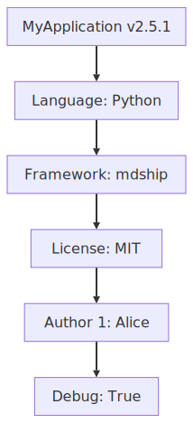

# Variables Feature Test

This document demonstrates the SET placeholder functionality in mdship.

## Variables Definition

The following variables are defined at the start:

<!--SET
appName: "MyApplication"
version: "2.5.1"
author: "Test Suite"
projectConfig:
  language: "Python"
  framework: "mdship"
  license: "MIT"
  authors:
    - "Alice"
    - "Bob"
    - "Charlie"
  settings:
    debug: true
    maxRetries: 3
-->

## Variable References

Variables defined above can be referenced throughout the document.

### Simple Variables

- Application Name: `$appName` (should show: MyApplication)
- Version: `$version` (should show: 2.5.1)
- Author: `$author` (should show: Test Suite)

### Nested Variables

- Language: `$projectConfig.language` (should show: Python)
- Framework: `$projectConfig.framework` (should show: mdship)
- License: `$projectConfig.license` (should show: MIT)

### Nested Structure Variables

- First author: `$projectConfig.authors[0]` (should show: Alice)
- Second author: `$projectConfig.authors[1]` (should show: Bob)
- Third author: `$projectConfig.authors[2]` (should show: Charlie)

### Deep Nesting

- Debug enabled: `$projectConfig.settings.debug` (should show: true)
- Max retries: `$projectConfig.settings.maxRetries` (should show: 3)

## Variable Syntax Forms

Variables support multiple syntax forms:

### Dollar Sign Notation

- Simple: `$appName`
- Nested: `$projectConfig.language`
- Array: `$projectConfig.authors[1]`

### Bracketed Notation

- Simple: `${appName}`
- Nested: `${projectConfig.framework}`
- Array: `${projectConfig.authors[0]}`

## MERMAID with Variables

The following diagram uses variables for dynamic labels:

<!--MERMAID
file: "_test_diagram.svg"
diagram: |
  graph TD
    A["$appName v${version}"] --\> B["Language: $projectConfig.language"]
    B --\> C["Framework: $projectConfig.framework"]
    C --\> D["License: $projectConfig.license"]
    D --\> E["Author 1: $projectConfig.authors[0]"]
    E --\> F["Debug: $projectConfig.settings.debug"]
-->

<!--/MERMAID-->

## Variable References in Markdown

Variables can also be directly referenced in the markdown document using special comment syntax.

### Simple Variable Reference (No Spaces)

For single-word values, use the format:

```
<!--$variable-->value_here
```

The value text will be replaced with the actual variable value.

Example in this document:

- Application: <!--$appName-->`MyApplication`
- Version: <!--$version-->2.5.1
- License: <!--$projectConfig.license-->MIT

### Variable Reference with Spaces

For values containing spaces, use a marker:

```
<!--$variable<MARKER>-->placeholder<!--MARKER-->
```

The simplest form uses empty markers.

Examples in this document:

- Framework: <!--$projectConfig.framework<>-->``mdship``<!---->
- Language: <!--$projectConfig.language<>-->Python<!---->
- First author: <!--$projectConfig.authors[0]<>-->Alice<!---->
- Second author: <!--$projectConfig.authors[1]<>-->Bob<!---->
- Third author: <!--$projectConfig.authors[2]<>-->Charlie<!---->

You can also use any arbitrary marker string:

- Debug mode: <!--$projectConfig.settings.debug<DEBUG>-->True<!--DEBUG-->
- Max retries: <!--$projectConfig.settings.maxRetries<RETRY>-->3<!--RETRY-->

### Complex References

Nested variables work the same way:

- Config language: <!--${projectConfig.language}-->Python
- Array element: <!--$projectConfig.authors[2]<>-->Charlie<!---->
- Deep nesting: <!--$projectConfig.settings.maxRetries-->3

### Important Notes

- Variable references are updated by `mdship update` command
- They are NOT updated in MERMAID diagram source (MERMAID variables stay as-is in document)
- Markers must match exactly: opening marker `<X>` must have closing marker `<!--X-->`
- Without spaces form must have placeholder with no spaces

## Documentation

Variables are collected during the first phase of `mdship update` command processing.
This allows:

- Defining variables anywhere in the document (position doesn't matter)
- Using variables in subsequent placeholders like MERMAID
- Complex nested structures with arrays and dictionaries
- Multiple syntax forms for flexibility

## Testing Notes

To test this document, run:

```bash
mdship update tests/test_variables.md
```

This will:

1. Collect all variables from SET placeholders
2. Process any INCLUDE placeholders
3. Generate table of contents (if TOC markers present)
4. Render MERMAID diagrams with variable substitution

The resulting diagram file at `tests/_test_diagram.svg` should show the substituted values.

## Additional Variables Example

For reference, here's what a more complex SET placeholder looks like:

```
<!--SET
deployment:
  production:
    host: "api.example.com"
    port: 443
    region: "us-east-1"
  staging:
    host: "staging-api.example.com"
    port: 8443
    region: "us-west-2"
features:
  - "authentication"
  - "caching"
  - "monitoring"
-->
```

Then you could reference:

- `$deployment.production.host` → "api.example.com"
- `$deployment.staging.region` → "us-west-2"
- `$features[1]` → "caching"

## XML import

<!--IMPORT
name: "wood_catalog"
from: "sample_data.xml"
-->
<!--$wood_catalog.catalog.type.@publicNameOnRecord-->sapele
<!--$wood_catalog.catalog.type.@catalog<>-->wood directory<!---->
<!--$wood_catalog.catalog.items.item[0].name-->walnut
<!--$wood_catalog.catalog.items.item[0].@serial-->63512

## JSON import

<!--IMPORT
name: "project_data"
from: "sample_data.json"
-->

|                       |                                                                                   |
|:----------------------|:----------------------------------------------------------------------------------|
| Project:              | <!--$project_data.project.name-->mdship                                           |
| Version:              | <!--$project_data.project.version-->1.0.0                                         |
| Description:          | <!--$project_data.project.description<😇>-->Markdown Mani Pulation Tool<!--😇-->  |
| Team Lead:            | <!--$project_data.team.lead<>-->Alice Johnson<!---->                              |
| First Developer:      | <!--$project_data.team.members[0].name<>-->Bob Smith<!---->                       |
| First Developer Role: | <!--$project_data.team.members[0].role-->Deviloper                                |
| Python Version:       | <!--$project_data.config.python_version-->3.11+                                   |

